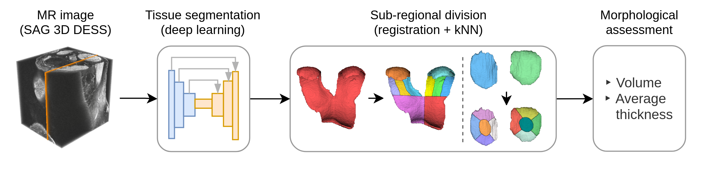

# scartan - Subregional Cartilage Analysis

Source code for Panfilov et al. "Deep Learning-based Segmentation of Knee MRI for Fully Automatic Sub-Regional Morphological Assessment of Cartilage Tissues: Data from the Osteoarthritis Initiative", https://doi.org/10.1002/jor.25150.

<p align="center">
 
</p>

### Description

1. The complete workflow is summarized in `entry/runner.sh` script. The code requires
   The Osteoarthritis Initiative (OAI) data from 00m, 12m, and 24m visits, particularly,
   SAG_3D_DESS MRI scans and textual (ASCII) demographic, quantitative, and
   semi-quantitative records.

2. The programming environment can be reproduced from the Conda configuration files -
   `conda-spec-file.txt` or `environment.yml`. The project code should then be installed
   as a Python module.
 
3. The original project files are structured as follows:

    ```
   proj_scartan/  
      | data/
         # ---- Preprocessed scans and annotations
         | 61_OAI_project_22_full_meta/
         | 91_OAI_iMorphics_full_meta/
         # ---- Built multi-atlases 
         | atlas_OAI_iMorphics_Imo/      
         | atlas_OAI_iMorphics_Chondr75n/
         | atlas_OAI_iMorphics_Biomediq/
      # ---- This repository   
      | src/
      # ---- Model weights, intermediate and final results   
      | results/EXPERIM_ID/
         | weights
         | logs_train
         | predicts_oai_imo_test
         | logs_oai_imo_test
         | predicts_oai_prj_22_test
         | logs_oai_prj_22_test
         | logs_register

   MedData/
      # ---- Raw OAI data and annotations
      | OAI_iMorphics_scans/
      | OAI_iMorphics_annotations/
      | OAI_project_22/
      | OAI_general/OAI_CompleteData_ASCII/
    ```

4. Pretrained models are available at https://drive.google.com/file/d/1SXlM5C_5yKYny5V-_T60yr8ZhNUjpbin .

### Legal aspects

This code is freely available only for research purposes.

The software has not been certified as a medical device and, therefore, must not be used
to guide any diagnostic or treatment decisions.

Commercial use of the provided code and the pretrained models is prohibited. For other
inquiries, please, contact the authors.   

### Cite this work

```
@article{panfilov2021deep,
  title={Deep Learning-based Segmentation of Knee MRI for Fully Automatic Sub-Regional Morphological Assessment of Cartilage Tissues: Data from the Osteoarthritis Initiative},
  author={Panfilov, Egor and Tiulpin, Aleksei and Nieminen, Miika T and Saarakkala, Simo and Casula, Victor},
  journal={Journal of Orthopaedic Research{\textregistered}},
  publisher={Wiley Online Library}
}
```
